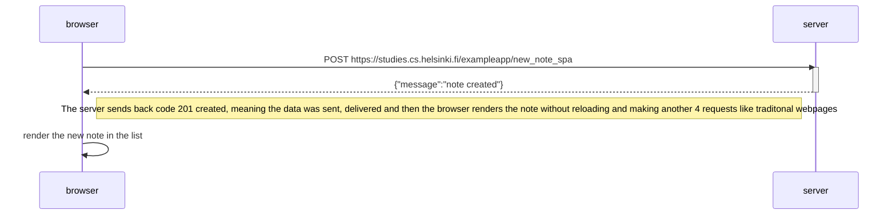

```mermaid
sequenceDiagram
    participant browser
    participant server

    browser->>server: POST https://studies.cs.helsinki.fi/exampleapp/new_note_spa
    activate server
    server-->>browser: {"message":"note created"}
    deactivate server

    Note right of browser: The server sends back code 201 created, meaning the data was sent, delivered and then the browser renders the note without reloading and making another 4 requests like traditonal webpages

    browser->>browser: render the new note in the list
```